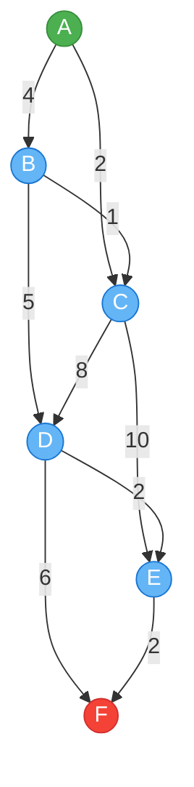

# Dijkstra's Algorithm: Finding the Shortest Path

Dijkstra's algorithm is a fundamental approach in graph theory that efficiently finds the shortest path between nodes in a graph. Let's explore how this elegant algorithm works through both explanation and visualization.

## 1. Graph Representation

In the implementation, the graph is represented as a map structure where:
- Each **key** is a `char` representing a node in the graph
- Each **value** is a collection of `punto` objects representing the edges from that node
  - Each `punto` contains the destination node and the distance (or weight) of the edge

Let's visualize our example graph:


In this graph visualization:
- **Green node (A)** represents the starting point
- **Red node (F)** represents the destination
- **Blue nodes** are intermediate points
- **Numbers on edges** indicate the distance or weight between nodes

## 2. Algorithm Steps

Dijkstra's algorithm follows a systematic approach to find the shortest path:

### Initialization Phase
1. Assign a distance value of 0 to the starting node
2. Assign infinity (∞) to all other nodes, indicating they haven't been reached yet
3. Create a set of all unvisited nodes

### Exploration Phase
While there are unvisited nodes:
1. Select the unvisited node with the smallest distance value (initially the start node)
2. Mark this node as visited
3. For each neighbor of the current node:
   - Calculate the total distance from the start node through the current node
   - If this new distance is less than the previously recorded distance, update it
   - Update the predecessor information for the neighbor

### Termination
The algorithm ends when either:
- The destination node has been visited (we found the shortest path)
- All reachable nodes have been visited (some nodes may be unreachable)

## 3. Code Implementation

The C++ implementation organizes the algorithm in a clear, object-oriented manner:

### Dijkstra Class Structure
- **Member Variables**:
  - `grafo`: Stores the graph structure
  - `distancias`: Tracks the current shortest distance to each node
  - `visitados`: Maintains a set of nodes that have been processed
  - `predecesores`: Records the previous node in the shortest path

### Key Methods
- `inicializarDistancias()`: Sets up the initial distances (0 for start, ∞ for others)
- `obtenerNodoMinimo()`: Finds the unvisited node with the smallest distance
- `actualizarDistancias(char nodoActual)`: Updates distances to neighbors
- `reconstruirCamino()`: Traces back through predecessors to build the path
- `calcularDistancias()`: Orchestrates the main algorithm execution

### In the Main Function
1. The graph is defined with its nodes and weighted edges
2. A Dijkstra object is created with the graph, start node, and end node
3. The algorithm is executed to find the shortest path
4. Results are displayed to the user

## 4. Example Execution

For our sample graph with:
- Starting node: 'A'
- Ending node: 'F'

The algorithm discovers the shortest path:
```
A → C → D → E → F
```

With a total distance of 12 units.

## 5. Tracing the Algorithm

Let's trace through the execution step by step:

1. Start at node A (distance = 0)
2. Visit neighbors of A:
   - Update B: distance = 4
   - Update C: distance = 2
3. Select node C (smallest unvisited distance)
4. Visit neighbors of C:
   - Update D: distance = 10
   - Update E: distance = 12
5. Select node B (next smallest unvisited distance)
6. Visit neighbors of B:
   - C is already visited
   - Update D: distance = 9 (better than previous 10)
7. Select node D (next smallest unvisited distance)
8. Visit neighbors of D:
   - Update E: distance = 11 (better than previous 12)
   - Update F: distance = 15
9. Select node E (next smallest unvisited distance)
10. Visit neighbors of E:
    - Update F: distance = 13 (better than previous 15)
11. Select node F (destination reached)

The final shortest path is reconstructed by following predecessors:
F ← E ← D ← C ← A, which gives us A → C → D → E → F.

## Conclusion

Dijkstra's algorithm demonstrates how a greedy approach (always choosing the closest unvisited node) can efficiently solve the shortest path problem. Its applications extend to numerous fields including network routing, transportation planning, and even video game pathfinding.